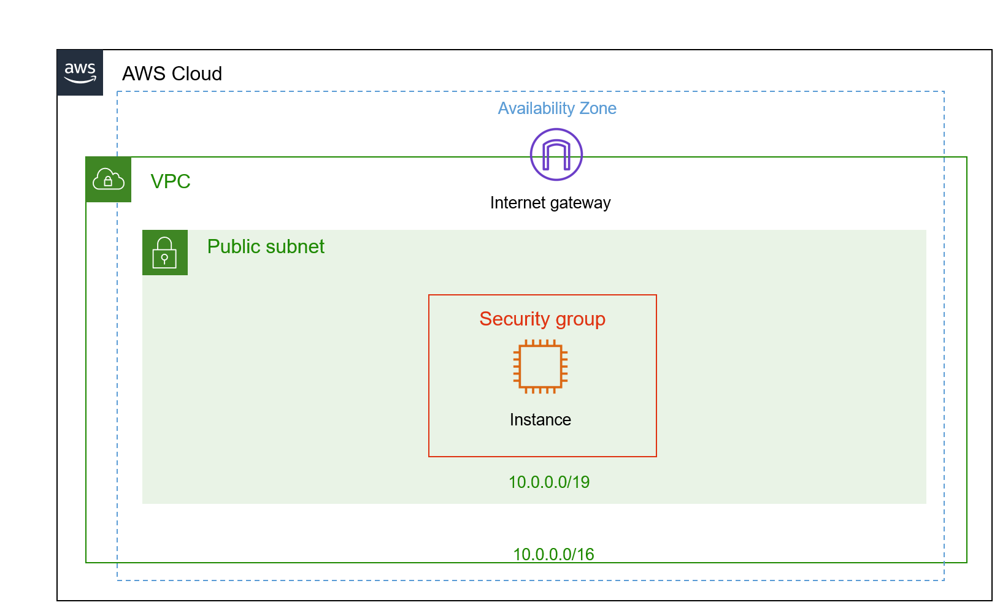
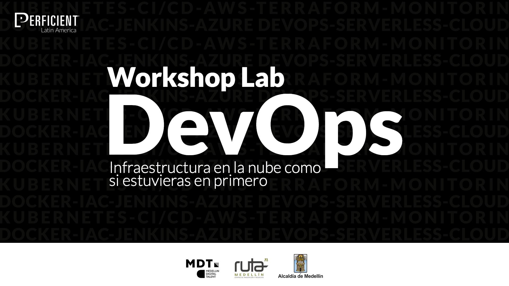

# Workshop Lab  DevOps Infraestructura en la nube como si estuvieras en primero 

## Description

En este Workshop aprenderemos todos los pasos y conceptos de networking necesarios para desplegar un servidor web a traves de la consola de AWS.

## Datos Importantes

### Link de Acceso a la Consola 

* [AWS Console](https://241507129644.signin.aws.amazon.com/console)

### Region de AWS donde se despliegaran los recursos es 

 * North Virginia us-east-1

### El usuario para la consola de AWS esta conformado de la siguiente manera:

* Usuario: primerNombre.primerapellido
* Contraseña: Password123*

**IMPORTANTE**: despues de que inicies sesion debes cambiar la contraseña la cual debe cumplir minimo con los siguientes requerimientos

* una miniscula
* una mayuscula
* un numero
* un simbolo especial

